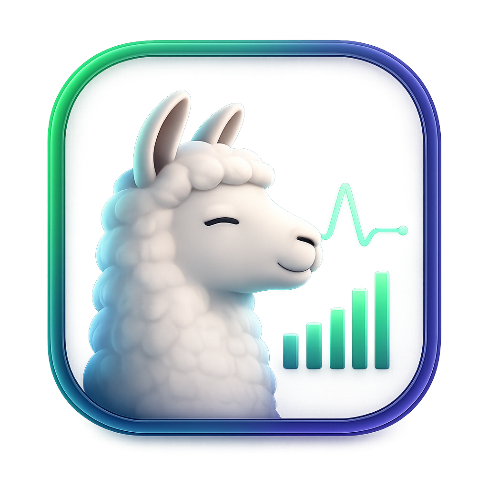

<p align="center">
  
</p>

# Ollama Dashboard

A lightweight **macOS menu-bar app** for keeping an eye on your local [Ollama](https://ollama.com) server. It lives in the menu bar (no Dock icon), shows live memory and model activity at a glance, and can detach into a floating window that stays on top of everything else.

The whole app is a single Swift file — no Xcode project, no dependencies beyond the system SwiftUI/AppKit frameworks.

## Features

- **Connection status & version** — green/red indicator and the running Ollama version.
- **Memory at a glance** — total RAM + VRAM currently held by loaded models, surfaced right in the menu bar.
- **Active models** — everything loaded in memory, with per-model size, a GPU/CPU placement bar, quantization/parameter tags, and a countdown to when each model unloads.
- **Recent queries** — a live feed of inference requests (chat / generate / embeddings / OpenAI-compat) parsed from Ollama's server log, with status and latency.
- **Installed models** — every model on disk with size and last-modified time.
- **Pin as a floating window** — detach the dashboard into an always-on-top panel that follows you across Spaces without stealing focus.
- **Auto-refresh** — polls every 2 seconds; manual refresh button too.

## Requirements

- macOS 13 (Ventura) or later
- The Swift toolchain (`xcrun swiftc`), included with Xcode or the Command Line Tools (`xcode-select --install`)
- A running Ollama server (`ollama serve`, default `http://127.0.0.1:11434`)

## Build & run

```sh
./build.sh
open ./OllamaDashboard.app
```

`build.sh` compiles the Swift source into a proper `.app` bundle and ad-hoc code-signs it. A bundled app (rather than the bare binary) gives the menu-bar presence and floating-window behavior a stable identity.

Look for the brain icon in your menu bar. Click it for the dashboard popover; hit the pin button to float it.

### Quick run without bundling

For a fast iteration loop you can skip the bundle, though window/menu-bar behavior is less reliable:

```sh
swiftc -O -parse-as-library OllamaDashboard.swift -o OllamaDashboard
./OllamaDashboard
```

## Configuration

Configured entirely through environment variables:

| Variable | Default | Purpose |
| --- | --- | --- |
| `OLLAMA_HOST` | `http://127.0.0.1:11434` | Ollama server URL. A bare `host:port` is accepted and gets an `http://` prefix. |
| `OLLAMA_LOGFILE` | `~/.ollama/logs/server.log` | Where to read the request log for the "Recent Queries" feed. Set this if you run `ollama serve` yourself and redirected its output. |

Example, pointing at a remote host:

```sh
OLLAMA_HOST=http://192.168.1.10:11434 open ./OllamaDashboard.app
```

## How it works

The app polls three Ollama HTTP endpoints on a timer:

- `GET /api/version` — server version & reachability
- `GET /api/ps` — models currently resident in memory
- `GET /api/tags` — models installed on disk

The "Recent Queries" feed is built separately by tailing the last chunk of Ollama's GIN access log and pulling out only the real inference endpoints, so the dashboard's own polling traffic doesn't drown out the feed. If the log file isn't found, that section explains how to point at it; everything else keeps working.

## Project layout

| File | Purpose |
| --- | --- |
| `OllamaDashboard.swift` | The entire app — config, API client, log parser, view model, and SwiftUI views. |
| `build.sh` | Compiles the source into `OllamaDashboard.app` and code-signs it. |

## License

Released under the [MIT License](LICENSE).
